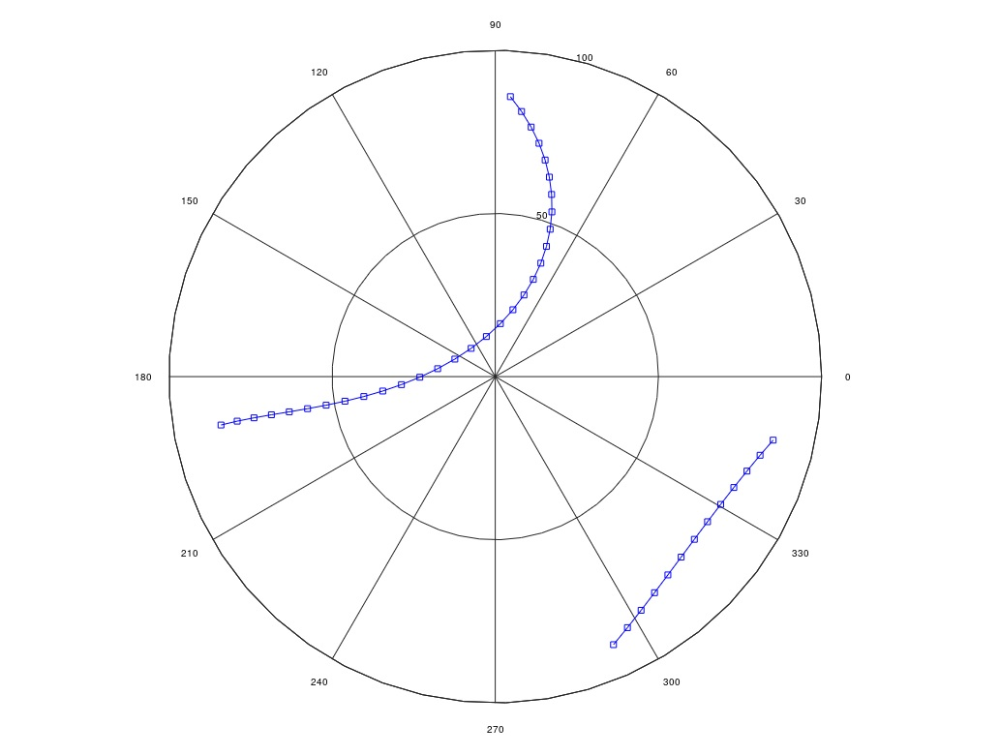

# Satellite Tracking with Frame Transformations

## Project Description

Step by step how the calculations are made is given in the **or_ct_h.pdf**  file. Please run **Ex4.m** file for the results. Explanations indicating the purpose of the code blocks are included in the comment lines in the algorithm. You can read the exercise presentation on **ex_o4_201920.pdf** file.

**spatial1.m, spatial2.m and spatial3.m** functions created for the rotation. Rotation is really important in 3D coordinate transformations. They are realized by 3x3 rotation matrices perspective for three axes of the cartesian frame. 

On the polar graph you can see the orbit of the satellite, which is the result and purpose of Exercise 4.

## Contact Me

If you have something to say to me please contact me: 

 - Twitter: [Doguilmak](https://twitter.com/Doguilmak)  
 - Mail address: doguilmak@gmail.com
 