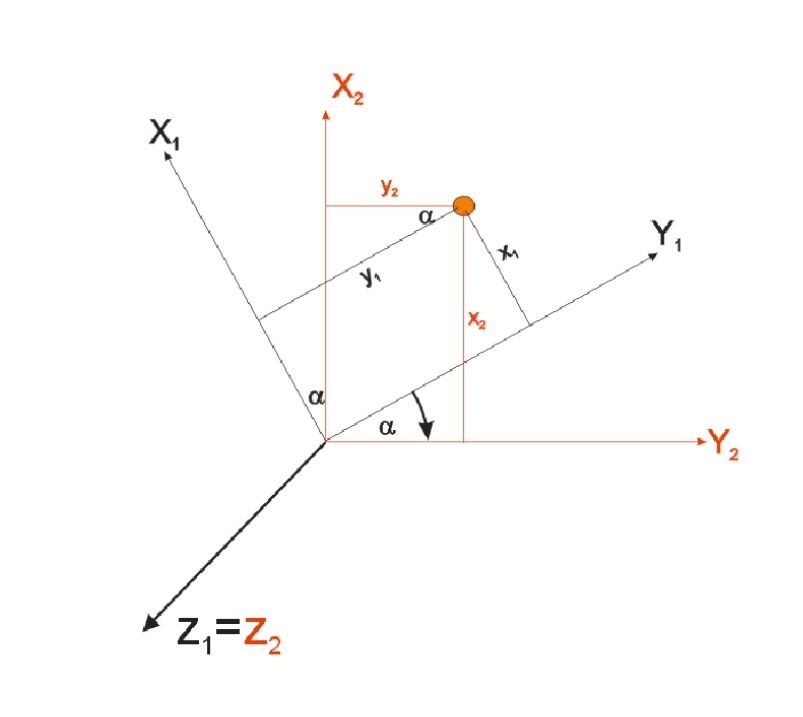
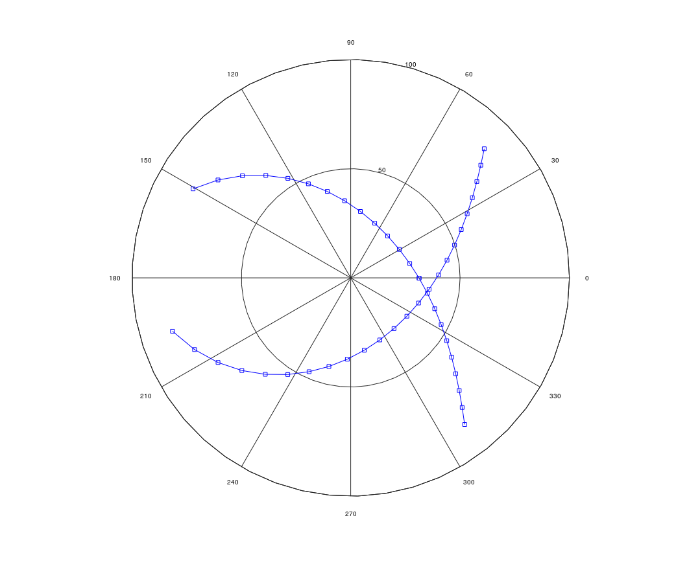

# Satellite Tracking in Conventional Terrestrial Reference Frame

## Project Description

Step by step how the calculations are made is given in the **or_ct_h.pdf**  file. Please run **Ex4.m** file for the results. Explanations indicating the purpose of the code blocks are included in the comment lines in the algorithm. You can read the exercise presentation on **ex_o4_201920.pdf** file. **NAD83 coordinates** used in this project. The information described in this repository is within the scope of the Advanced Geodesy and Geodetic Astronomy course. This course was given by **Dr. hab. inż. Wojciech Jarmołowski**. I learned a lot from him.

## Satellite’s Position in Space is Determined by Six Parameters

$a_0, e_0$ - define geometry of orbital ellipse , i.e. its size and shape

$\omega, v$ - define orientation of the orbit and satellite position in orbit

$\Omega, i$ - define orientation of the orbit in space (i.e. its orientation in RA)

 

We can define satellite’s position in space, by defining this in its Orbital Frame (OR):

**Central Point** – Center of Earth masses

**Primary axis - (z)** – Normal to orbital frame

**Secondary axis - (x)** – Intersects the perigee

**Third order axis - (y)** - Orthogonal in right-handed frame

 

$K$ - ascending node of the satellite

$K'$ - descending node

$E$ - Earth (coincides with one of the focal points of the ellipse)

$P$ - perigee – point in orbit closest to Earth, located at main
axis of orbital ellipse)

$A$ - apogee – the most distant point of the orbit

$a_0$ - semi-major axis of orbital ellipse

$e_0$ - eccentricity of orbital ellipse

$i$ - inclination angle between orbital plane and celestial
equator

$\Omega$ - right-ascension of ascending node (RAAN)

$\omega$ - argument of perigee – angular distance of perigee from
ascending node

$v$ - true anomaly – angular distance of satellite from perigee

$r$ - distance of the satellite from the center of Earth masses

	

**spatial1.m, spatial2.m and spatial3.m** functions created for the rotation. Rotation is really important in 3D coordinate transformations. They are realized by $3x3$ rotation matrices perspective for three axes of the cartesian frame. 

**Rotation matrices:** 

$$R_x(\theta) = \begin{vmatrix*}[r]  
1 & 0 & 0\\
0 & cos\theta & -sin\theta\\  
0 & sin\theta  & cos\theta
\end{vmatrix*}$$

    function R1 = spatial1(a1);

	R1 = [1,0,0;0,cos(a1),-sin(a1);0,sin(a1),cos(a1)];

$$R_y(\theta) = \begin{vmatrix*}[r]  
cos\theta & 0 & sin\theta\\
0 & 1 & 0\\  
-sin\theta & 0  & cos\theta
\end{vmatrix*}$$

    function R2 = spatial2(a2);
  
	R2 = [cos(a2),0,sin(a2);0,1,0;-sin(a2),0,cos(a2)]

$$R_z(\theta) = \begin{vmatrix*}[r]  
cos\theta & -sin\theta & 0\\
sin\theta & cos\theta & 0\\  
0 & 0  & 1
\end{vmatrix*}$$

    function R3 = spatial3(a3);

	R3 = [cos(a3),-sin(a3),0;sin(a3),cos(a3),0;0,0,1];

 

To calculate rECI, we need to make matrix multiplication using our rotation matrices.

$$rECI = R_z(-\Omega) ⋅ R_x(-i) ⋅ R_z(-\omega) ⋅ rPQW$$

    R1ixR3w = np.matmul(R1i, R3w)
    R3wR1R3 = np.matmul(R3omega, R1ixR3w)
    ECI = np.matmul(R3wR1R3, PQW)

 

## Calculation of Satellite Position in Conventional Terrestrial Reference Frame

According to the second Kepler’s Law, the motion of the satellite along the orbit is non-uniform. The position of the satellite in the orbital plane relatively to the perigee is determined by true anomaly $v$ which is a function of time. The true anomaly changes unevenly over time, which means that $v$ is a nonlinear function of time and is not convenient to use. An alternative way to describe the movement of the satellite is the so-called eccentric anomaly $E$. The concept of eccentric anomaly is similar to the concept of reduced latitude:

$$e^{OR} = \begin{vmatrix*}[r]  
r ⋅ cos v \\
r ⋅ sin v \\  
0
\end{vmatrix*} = \begin{vmatrix*}[r]  
a_0(cosE-e_0) \\
b_0 ⋅ sin E \\  
0
\end{vmatrix*}$$

    eOR(:,:) = [a0*(cos(E)-e0);
    b0*sin(E); 
    zeros(1, length(ST))]

The transformation from the OR orbital frame to the right-ascension frame RA reads:

$$rECI = R_z(-\Omega) ⋅ R_x(-i) ⋅ R_z(-\omega) ⋅ e^{OR}$$

	eRA = spatial3(-OM)*spatial1(-iq)*spatial3(-om)*eOR

## Calculation of the satellite position in the observer's frame (horizontal - H)

The position in OR frame can also be transformed to the observer’s (horizontal) H system. We will then know the satellite's visibility in the local sky. The starting steps are the same as in the previous transformation (transformation to RA). Then we recalculate to HA frame (iterations for ST):

$$e_{ST}^{HA} = P_2 ⋅ R_3(ST) ⋅ e^{RA}$$

	eHAST = P2 * spatial3(ST) * eRA

Subsequently we need to reduce the difference in directions and distances due to the distance between the Earth's mass center and the observer. For this purpose, we find the position of the observer in the HA system. It does not depend on time and does not require iterations.

$$e_{obs}^{HA} = \begin{vmatrix*}[r]  
R ⋅ cos \varphi \\
0 \\  
R ⋅ sin\varphi
\end{vmatrix*}$$

	eHAobs = [R * cos(phi); 0; R * sin(phi)];

Then we must use the position of the observer in HA, for reducing the vector to the satellite, and transform it to H:

$$e_{ST}^{H} = R_3(\pi) ⋅ R_2(\dfrac{\phi} 2 - \phi) ⋅ (e_{ST}^{HA}  - e^{HA} ⋅ obs)$$

	eHST(:,i) = spatial3(pi) * spatial2((pi/2) - phi) * (eHA(:,i) - eHAobs)

## Exercise

Having given the position of the satellite in $OR$, check its availability on the visible part of the celestial sphere at the given moment of sidereal time $(ST)$. Use a loop to calculate the satellite track during the day. Start with $eOR$, then transform to $RA$, which is possible without the loop. Next, using the loop and the parameters variable in time $(ST, E)$, calculate $e_{ST}^{HA}$, $e_{obs}^{HA}$, and finally $e_{ST}^{H}$. Start the loop as follows, but extend it to calcualtion of $eH$, $A$, $Z$:

Calculate $A$, $Z$ (for zenital distance use $Z = 90° - atan(\dfrac{z} p)$ to avoid negative $Z$ below the horizon) in degrees minutes and seconds). Make polar plot for $A$ in radians and $Z$ in decimal degrees.

**Parameters:**

	rad = pi/180
	iq = (55 * pi/180);
	ST = [0:.2:24] * pi/12;
	E = (2*ST);
	a0 = 26560; % semi-major axis GRS80
	e0 = 0.02; % first eccentricity GRS80
	b0 = a0*sqrt(1-e0);
	OM = 150 * rad;
	om = 45 * rad;
	R = 6371; %approximately
	phi = 53 * rad;
	P2=[1 0 0;0 -1 0;0 0 1];

**Use polar plot for drawing the observer’s hemisphere:**

	for z=1:length(zh)
		if zh(z)>90;
			zh(z)=NaN;
		end
	end
	polar(ah,zh,'-bs');% ah is in radians
	view(90,-90)

**Output:**

On the polar graph you can see the orbit of the satellite, which is the result and purpose of Exercise 4.

## Contact Me

If you have something to say to me please contact me: 

 - Twitter: [Doguilmak](https://twitter.com/Doguilmak)  
 - Mail address: doguilmak@gmail.com
 
